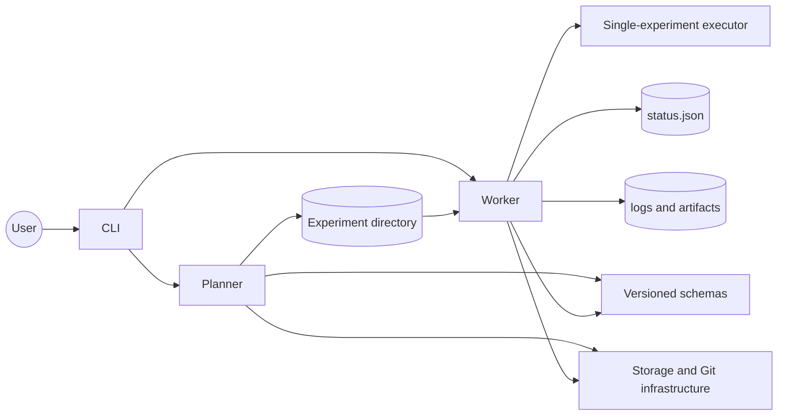
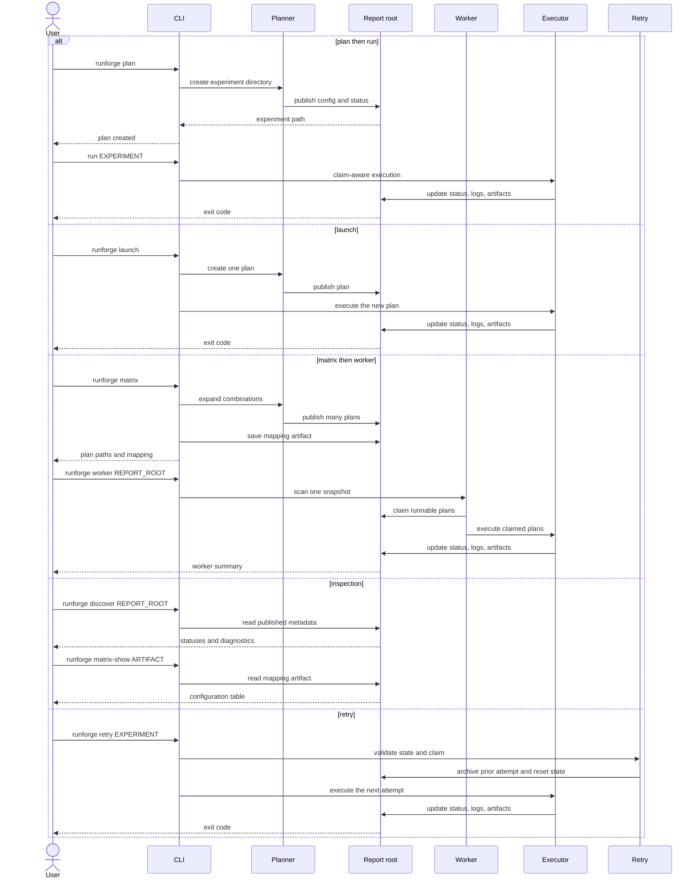

# Architecture And Workflows

RunForge is organized around two roles and one durable artifact. A **planner**
creates immutable experiment directories; a **worker** reconstructs and executes
one of them. The experiment directory is the unit of work, and there is no
central mutable queue or manifest.



The planner publishes the durable experiment directory. The worker later
consumes that directory and records execution state, logs, and artifacts.

## Package Responsibilities

```text
src/runforge/
  cli/             # parser construction, request translation, output, dispatch
  schemas/         # strict versioned experiment and source data contracts
  planning/        # matrix expansion, source normalization, plan publication
  execution/       # discovery, retry, and worker execution
  infrastructure/  # experiment storage, Git, directory scanning, atomic JSON, claims, clock
```

Dependencies flow one way:

```text
cli -> planning / execution -> schemas / infrastructure
```

`schemas` holds no workflow or filesystem behavior. `infrastructure` owns
external and on-disk mechanics without depending on planning, execution, or CLI
code. `planning` and `execution` share those foundations while remaining
independent workflows. The CLI composes them and owns all human-readable
presentation — no module below `cli/` writes to the console.

`ExperimentDirectory` is the single owner of standard experiment paths and typed
persistence. Workflows do not repeat filename literals or decode JSON ad hoc.

## CLI Command Relationships

The CLI exposes separate commands for planning, inspection, and execution. The
same durable experiment directory connects commands that run at different
times.



## Why Planning And Execution Are Separate

The two happen at different times, often on different machines. A plan captures
intent and source identity durably; a worker consumes it later, possibly
elsewhere, possibly in parallel with other workers. Keeping them separate is
what makes an experiment directory portable and auditable.

Planning never executes. That is not a limitation but the property that lets a
matrix expand hundreds of plans safely before a single command starts.

## Atomic Publication

A plan is built in a dot-prefixed staging directory inside the report root and
renamed into place only when complete. A reader therefore sees either a fully
published plan or nothing.

Discovery skips dot-prefixed directories precisely so an in-flight staging tree
is never surfaced as runnable work. Without that, a worker scanning concurrently
could claim and execute a plan that publication was still writing — and would
then have it renamed or deleted underneath it.

This is why planning into a report root that workers are actively consuming is
safe.

## Verification Before Execution

The worker verifies before it acts: planned input digests, and for non-Git modes
the complete source manifest and full-tree digest. A mismatch fails the
experiment rather than producing a run whose provenance is wrong.

Ordering matters here. Verification happens before source preparation and before
the child command starts, so a tampered plan never partially executes.
