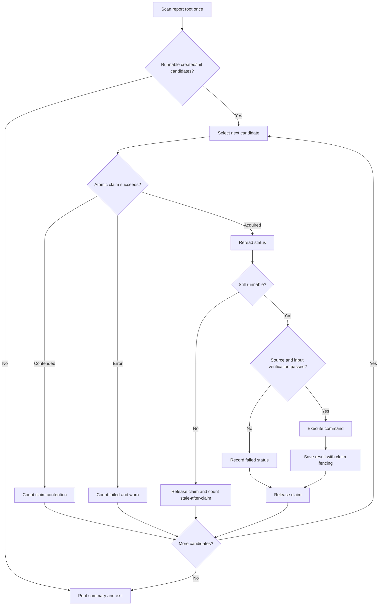

# Worker Lifecycle And Claims

The worker is a thin wrapper around the single-experiment executor. It adds two
responsibilities and no more: selecting ready experiments from one discovery
snapshot, and atomically claiming each one immediately before delegating.

It is not a daemon, scheduler, durable queue, or task-recovery service. This
page explains why.

## The Lifecycle

```text
scan the report root once
    |
    +-- created/init -> ordered candidate list
    +-- inprogress/completed/failed -> ignore
    |
for each candidate:
    atomic claim -> reread status -> execute, or skip
    |
candidates exhausted or --max-tasks reached
    |
print summary and exit
```



The diagram shows why a worker can safely share one report root with peers:
claim creation is the ownership boundary, and status writes are fenced by the
claim token.

There is no final rescan, idle scan, poll interval, pending queue, or wait for
other workers. Work created after the snapshot belongs to a later invocation.

## Why The Claim, Not The Ordering

Every worker may compute the same candidate order. A startup time gap usually
reduces contention, but ordering and timing are not correctness mechanisms —
only the atomic claim decides ownership.

A claim is a directory created with an exclusive operation. Its existence is the
lock; creation either succeeds for exactly one process or fails with
`FileExistsError` for the rest. Replacing a JSON file could never provide this,
which is why a claim is never acquired or transferred by writing status.

## Post-Claim Reread

Winning the claim is not sufficient. The snapshot may be stale: a peer may have
completed the experiment between the scan and the claim. The worker therefore
rereads status after claiming and, if the experiment is no longer runnable,
records it as *stale after claim* rather than as a failure.

That distinction matters in practice. Without it, a healthy multi-worker run
reports spurious failures for work that actually succeeded.

## Ownership Fencing

Every status write is fenced by the claim token. If ownership changed — because
an operator forced recovery, for instance — the write is refused and the worker
stops mutating the experiment.

The token is a random 128-bit value, unrelated to any host or timestamp, so it
cannot be guessed or reconstructed by a competing process. The `owner` field
beside it is diagnostic only and never consulted when deciding ownership; it
exists so a human can identify which process to check.

## What Happens When A Worker Dies

The experiment stays `inprogress` with a claim no live process owns. RunForge
does not guess whether a long-running experiment is dead, because it cannot
distinguish that from one that is merely slow. Recovery is explicit and
operator-confirmed through `retry --force`.

Leases, heartbeats, automatic stale-claim recovery, and bounded reissue are
deliberately absent. They were designed and rejected as the *foundation* for
lightweight execution: making a persistent lease-aware worker the basis would
have imposed timing assumptions, clock-skew tolerances, and false-recovery risk
on the simple local case that needs none of it. They remain possible as a
separate future worker built on the same ownership boundary.

## Release Is Best-Effort

If a claim cannot be released after execution, the worker warns but keeps the
recorded result. The experiment completed; failing it because cleanup failed
would misreport durable work. The leaked claim needs an operator, and the
warning says so.
